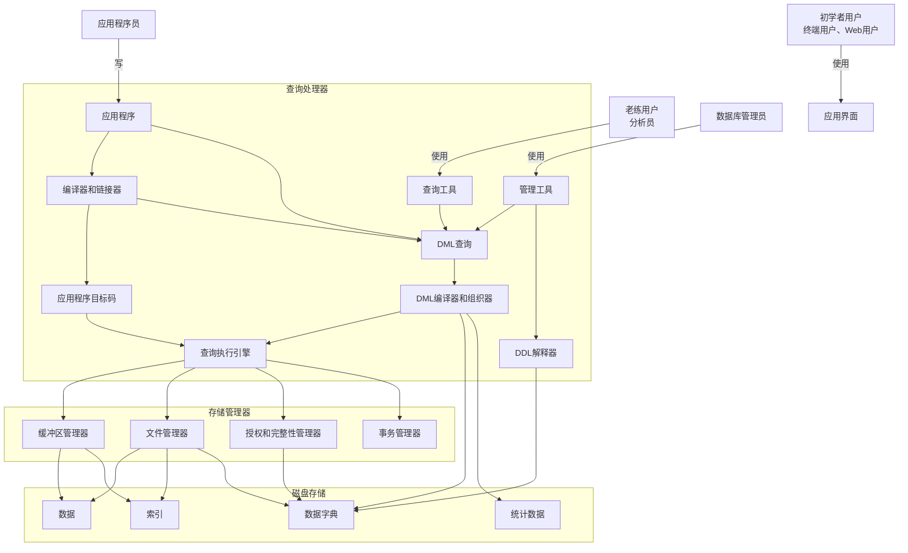

DBMS数据库管理系统，日常使用场景，联机事务，数据分析

数据模型分类

关系模型：数据和数据之间的关系

**实体-联系模型（E-R）：实体，基本对象集合和对象之间的联系**

半结构化数据模型：和E-R的本质区别是每个数据模型中属性的值类型是否唯一，半结构化数据中允许有多个值JSON/XML就是典型的半结构化数据

**基于对象的数据模型：OOP，面向对象思维**

数据抽象：物理层 -- 物理模式，逻辑层 --  逻辑模式，视图层 -- 子模式（MVC思想）

数据集合--instance

数据库语言分类：

DDL--数据库定义语言，定义，约束，引用的完整性，授权等

DML--数据库操纵语言(CRUD)

数据库设计：范式和非范式设计

查询处理器

DDL

DML 编译

存储管理器：权限和完整性管理器，事务管理器【并发控制管理器】，文件管理器，缓冲区管理器，数据文件，数据字典，索引

恢复管理器

用户 -> app ->  db
用户 -> 客户端 -> app -> db
