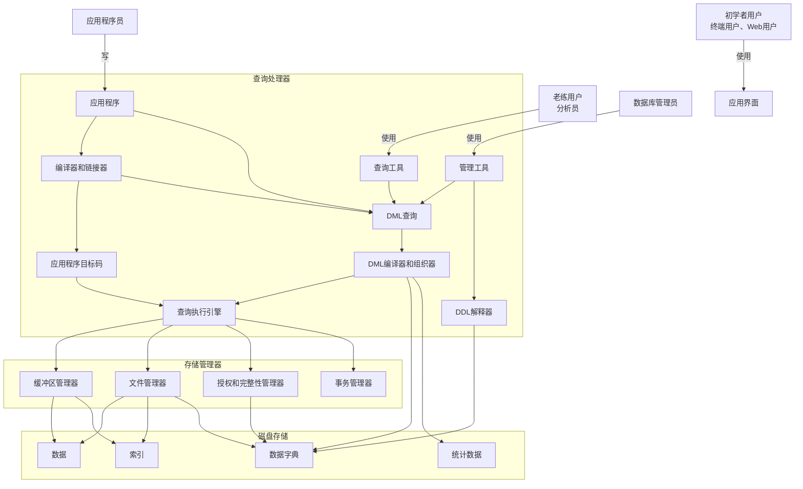

DBMS数据库管理系统，日常使用场景，联机事务，数据分析

数据模型分类

关系模型：数据和数据之间的关系

**实体-联系模型（E-R）：实体，基本对象集合和对象之间的联系**

半结构化数据模型：和E-R的本质区别是每个数据模型中属性的值类型是否唯一，半结构化数据中允许有多个值JSON/XML就是典型的半结构化数据

**基于对象的数据模型：OOP，面向对象思维**

数据抽象：物理层 -- 物理模式，逻辑层 --  逻辑模式，视图层 -- 子模式（MVC思想）

数据集合--instance

数据库语言分类：

DDL--数据库定义语言，定义，约束，引用的完整性，授权等

DML--数据库操纵语言(CRUD)

数据库设计：范式和非范式设计

查询处理器

DDL

DML 编译

存储管理器：权限和完整性管理器，事务管理器【并发控制管理器】，文件管理器，缓冲区管理器，数据文件，数据字典，索引

恢复管理器



用户 -> app ->  db
用户 -> 客户端 -> app -> db

**关系语言**

关系数据库

table 关系

原子属性，不可分割，属性的取值范围叫做域

null 属性

tuple  元组（行）

属性（列）

关系实例，一个完整的表结构定义

码

超码

标识唯一的一条记录，可以有冗余属性

候选码=不带重复属性的最小超码

主键约束，候选码中选择的属性

外键约束，表述数据引用关系

关系代数

select选择

投影运算

笛卡尔积

连接运算

集合运算

赋值运算

更名运算

等价查询

表 运算 表 => 新表

```SQL
# σ age > 18 (Student)
SELECT *
FROM Student
WHERE age > 18;

# 关系代数里的投影默认会去重，因为关系是集合，不允许重复元组。SQL 默认不去重，除非使用 DISTINCT
# π name, age (Student)
SELECT name, age
FROM Student;

# 笛卡尔积 Student × Class
SELECT *
FROM Student
CROSS JOIN Class;

SELECT *
FROM Student, Class
WHERE Student.class_id = Class.class_id;

# 自然连接
Student(sid, name, class_id)
Class(class_id, class_name)
Student ⋈ Class
# 字段名相同的误连接风险
SELECT *
FROM Student
NATURAL JOIN Class;

# 集合运算
StudentA(sid, name)
StudentB(sid, name)
# R ∪ S
SELECT sid, name FROM StudentA
UNION
SELECT sid, name FROM StudentB;

# R ∩ S
SELECT sid, name FROM StudentA
INTERSECT
SELECT sid, name FROM StudentB;

# R − S
SELECT sid, name FROM StudentA
EXCEPT
SELECT sid, name FROM StudentB;

# 更名运算
ρ S(Student)
SELECT *
FROM Student AS S;

# 等价查询
σ age > 18 (Student ⋈ Class)
(σ age > 18 (Student)) ⋈ Class
SELECT *
FROM Student s
JOIN Class c ON s.class_id = c.class_id
WHERE s.age > 18;
# 选择下推，先筛选，再连接
SELECT *
FROM (
    SELECT *
    FROM Student
    WHERE age > 18
) s
JOIN Class c ON s.class_id = c.class_id;

# 投影下推，连接筛选
π name, class_name (Student ⋈ Class)
π name, class_id(Student) ⋈ π class_id, class_name(Class)

# 连接与笛卡尔积等价
R ⋈ 条件 S = σ 条件 (R × S)
Student ⋈ Student.class_id = Class.class_id Class
σ Student.class_id = Class.class_id (Student × Class)
SELECT *
FROM Student s
JOIN Class c ON s.class_id = c.class_id;
SELECT *
FROM Student s, Class c
WHERE s.class_id = c.class_id;

# T ← E 把表达式 E 的查询结果赋值给临时关系 T
# AdultStudent ← σ age >= 18 (Student)
WITH AdultStudent AS (
    SELECT *
    FROM Student
    WHERE age >= 18
)
SELECT *
FROM AdultStudent;
```

| 关系代数 | 含义 | SQL 对应 |
| --- | --- | --- |
| `σ` 选择 | 选行 | `WHERE` |
| `π` 投影 | 选列 | `SELECT 字段` |
| `×` 笛卡尔积 | 两表全部组合 | `CROSS JOIN` |
| `⋈` 连接 | 按条件关联 | `JOIN ... ON` |
| `∪` 并 | 合并结果 | `UNION` |
| `∩` 交 | 共同部分 | `INTERSECT` |
| `−` 差 | R 有 S 没有 | `EXCEPT` / `NOT EXISTS` |
| `ρ` 更名 | 改表名/字段名 | `AS` |
