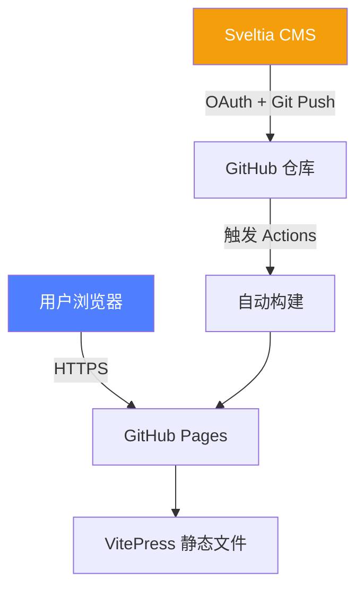
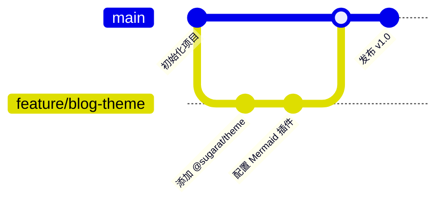
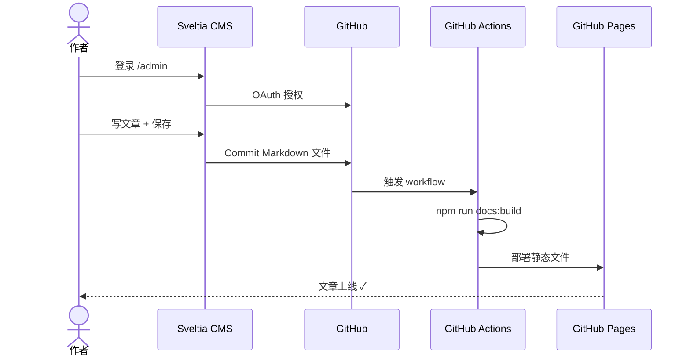

# 博客全功能演示

这篇文章演示本博客支持的所有 Markdown 增强特性。

[[toc]]

## 数学公式（LaTeX / MathJax）

行内公式：质能等价 $E = mc^2$，欧拉公式 $e^{i\pi} + 1 = 0$。

块级公式——贝叶斯定理：

$$
P(A \mid B) = \frac{P(B \mid A)\, P(A)}{P(B)}
$$

傅里叶变换：

$$
\hat{f}(\xi) = \int_{-\infty}^{\infty} f(x)\, e^{-2\pi i x \xi}\, dx
$$

正态分布概率密度函数：

$$
f(x) = \frac{1}{\sigma\sqrt{2\pi}}\, e^{-\frac{1}{2}\left(\frac{x-\mu}{\sigma}\right)^2}
$$

## 流程图（Mermaid）

### 系统架构图



### Git Flow 工作流



### 时序图：文章发布流程



## 代码高亮

### TypeScript 类型体操

```typescript twoslash
type DeepReadonly<T> = {
  readonly [K in keyof T]: T[K] extends object ? DeepReadonly<T[K]> : T[K]
}

interface Config {
  server: {
    port: number
    host: string
  }
  debug: boolean
}

const cfg: DeepReadonly<Config> = {
  server: { port: 3000, host: 'localhost' },
  debug: false,
}

// @errors: 2540
cfg.debug = true
```

### Vue 3 Composition API

```vue
<script setup lang="ts">
import { ref, computed, watchEffect } from 'vue'

interface Post {
  id: number
  title: string
  tags: string[]
  published: boolean
}

const posts = ref<Post[]>([])
const filter = ref('')

const filteredPosts = computed(() =>
  posts.value.filter(
    p => p.published && p.title.toLowerCase().includes(filter.value.toLowerCase())
  )
)

watchEffect(async () => {
  const res = await fetch(`/api/posts?q=${filter.value}`)
  posts.value = await res.json()
})
</script>

<template>
  <input v-model="filter" placeholder="搜索文章…" />
  <ul>
    <li v-for="post in filteredPosts" :key="post.id">
      {{ post.title }}
      <span v-for="tag in post.tags" :key="tag" class="tag">{{ tag }}</span>
    </li>
  </ul>
</template>
```

## 自定义容器

::: tip 提示
这是一个**提示**容器，适合放补充说明。
:::

::: warning 注意
这是一个**警告**容器，放需要特别注意的内容。
:::

::: danger 危险
这是一个**危险**容器，放可能造成问题的操作。
:::

::: details 点击展开详情
这里是折叠的内容，适合放篇幅较长但非必读的内容，比如完整代码、详细步骤等。

```bash
# 完整的安装命令
npm install @sugarat/theme vitepress-plugin-mermaid markdown-it-mathjax3 @shikijs/vitepress-twoslash
```
:::

## 表格

| 插件 | 功能 | 状态 |
|------|------|------|
| `@sugarat/theme` | 中文博客主题 | ✅ 已启用 |
| `vitepress-plugin-mermaid` | 流程图/时序图 | ✅ 已启用 |
| `markdown-it-mathjax3` | LaTeX 数学公式 | ✅ 已启用 |
| `@shikijs/vitepress-twoslash` | TS 代码交互提示 | ✅ 已启用 |
| Giscus | 评论系统 | 🔧 配置中 |

## 图片懒加载

图片默认开启懒加载（`loading="lazy"`），大图点击可放大预览：


---

以上就是本博客支持的全部富文本特性。开始写你的第一篇文章吧！
